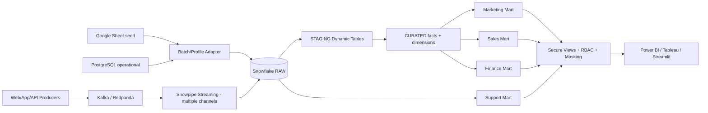

# Enterprise Data Platform — 1.6M+ Events/sec Simulation + Snowflake Governed Marts

This repository implements the requested enterprise data platform around the supplied Google Sheet and adds synthetic operational data needed for Marketing, Sales, Finance and Support analytics.

## What is implemented

- **Source seed**: runtime ingestion of Google Sheet `16zlUwChc8rAZYrChvgvSGBVmN8nSlY-7wKQLu5ibbno`; schema is profiled dynamically and every unknown source column is retained in `SOURCE_PAYLOAD` for auditability.
- **Operational reference datasets**: customers, products, campaigns and support tickets generated with deterministic synthetic data.
- **Live event simulation**: commerce/customer events at a configurable logical rate; default **1.8M events/sec**, minimum **1.6M/sec**.
- **Physical microbatch benchmark**: materialises 100K–1M rows to measure the machine's real Python generation rate separately from the logical simulation.
- **Streaming architecture**: designed for multiple long-lived deterministic Snowpipe Streaming channels. Real 1.6M rows/sec must be load-tested on the target Snowflake account with the final event byte size.
- **Snowflake zones**: `RAW`, `STAGING`, `CURATED`, `MARTS`, `GOVERNANCE`.
- **Near-real-time transformations**: Snowflake Dynamic Tables with `DOWNSTREAM` intermediate freshness and 1-minute leaf marts.
- **Governance**: RBAC, column masking policies, PII classification tag, secure departmental views, no BI access to raw tables.
- **Department marts**:
  - `MART_MARKETING_DAILY` — impressions, cart activity, conversions, attributed revenue.
  - `MART_SALES_DAILY` — orders, revenue, payment authorisations by region/category/brand.
  - `MART_FINANCE_DAILY` — gross revenue, estimated COGS, fees, net contribution.
  - `MART_SUPPORT_DAILY` — tickets, first response, P95 resolution, resolution rate.
- **BI demo**: Streamlit live dashboard switching across Marketing, Sales, Finance and Support.
- **dbt**: starter source freshness, staging models, marts and data tests.

## Architecture



## 1. Local setup

```bash
cd enterprise_data_platform
python -m venv .venv
source .venv/bin/activate     # Windows: .venv\\Scripts\\activate
pip install -r requirements.txt
cp .env.example .env
python -m src.data.generate_dimensions
pytest -q
streamlit run dashboard/app.py
```

The dashboard intentionally defaults to **1,800,000 logical events/sec**. It does not allocate 1.8M Python objects every second; that would make a laptop UI the bottleneck and would be a misleading Snowflake benchmark.

## 2. Profile the supplied Google Sheet

```bash
python -m src.data.bootstrap_source
```

The downloader uses the Sheet CSV export endpoint. `source_adapter.py` auto-detects common IDs/timestamps/amount columns and preserves the entire original row as JSON-compatible payload.

## 3. Start local infrastructure

```bash
docker compose up -d
```

This provides PostgreSQL, Redpanda (Kafka API) and MinIO to demonstrate the operational/batch/stream/raw-lake responsibilities before Snowflake.

## 4. Configure Snowflake

The account is prefilled:

```text
SNOWFLAKE_ACCOUNT=UIEPPMA-ME31407
```

Add your user and authentication to `.env`. Do **not** commit passwords/private keys.

Run the SQL files in numeric order from `snowflake/sql/` using Snowsight or SnowSQL. `00_bootstrap.sql` currently uses `ACCOUNTADMIN` only to create roles/warehouses/database; in production, split this into platform-admin and deployer roles.

Then load reference data:

```bash
python scripts/load_reference_data.py
python scripts/load_source_sheet.py
```

## 5. Live throughput model

`EventSimulator.logical_tick()` represents the business event load at >=1.6M events/sec for a live architectural demo. `generate_microbatch()` materialises actual rows for correctness and local throughput measurement:

```bash
python scripts/benchmark_simulation.py
```

For a true Snowflake 1.6M-row/sec acceptance test:

1. Measure average encoded bytes/event using the production schema.
2. Provision multiple producer processes/containers.
3. Keep Snowpipe Streaming channels long-lived and deterministic.
4. Start below target and ramp 25% → 50% → 75% → 100% → 120%.
5. Measure accepted rows/s, bytes/s, end-to-end freshness, error/retry rate and cost.
6. Pass only when the target is sustained for the agreed soak period without violating freshness/SLA thresholds.

A topology calculator is available:

```bash
python -m src.ingestion.streaming_design
```

The per-channel figure in that helper is an **input from your benchmark**, not a claimed Snowflake guarantee.

## 6. Governance model

Department BI users receive only their secure view:

| Role | Governed object |
|---|---|
| `EDP_MARKETING` | `MARTS.VW_MARKETING` |
| `EDP_SALES` | `MARTS.VW_SALES` |
| `EDP_FINANCE` | `MARTS.VW_FINANCE` |
| `EDP_SUPPORT` | `MARTS.VW_SUPPORT` |

Email and phone masking policies demonstrate PII protection. Production rollout should additionally add access-history review, ownership roles, network policies, SSO, key-pair auth, retention rules, quality contracts and alerting.

## 7. BI connection

Connect Power BI/Tableau to:

- account: `UIEPPMA-ME31407`
- database: `ENTERPRISE_DATA`
- schema: `MARTS`
- warehouse: `EDP_BI_WH`
- role: the department-specific BI role

Never point departmental dashboards at `RAW`.

## Important limitation

The referenced Hackveda project page and Google Sheet were not readable by the execution environment while this package was being built. The implementation therefore follows the requirements stated in the request and makes the Sheet ingestion schema-adaptive. Once the links are reachable in the runtime, no source-code redesign is needed to ingest the sheet; however, any additional project-brief requirements not stated in the request should be reconciled against this repository before production acceptance.
